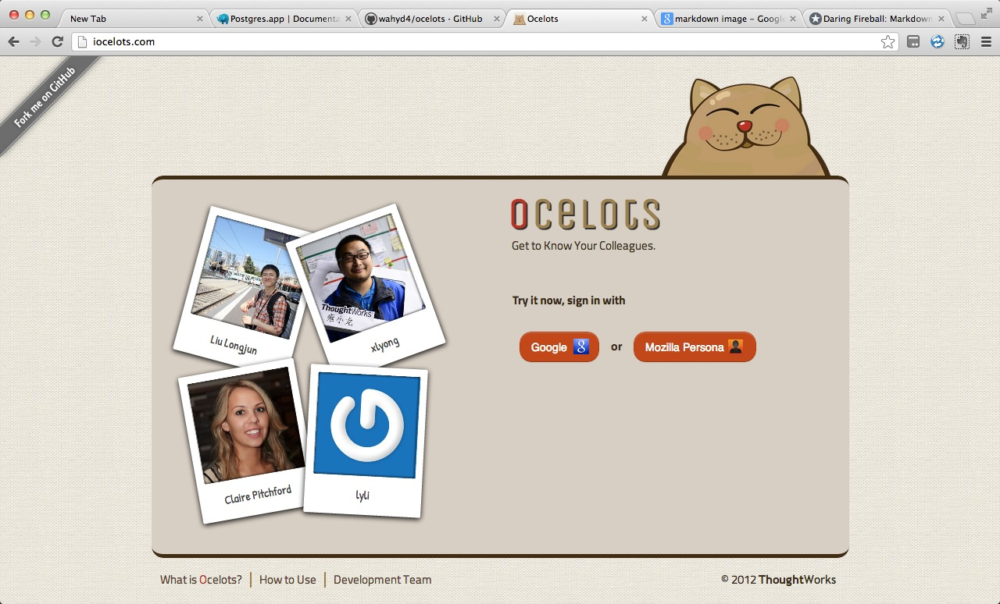

# Ocelots

  

## Screenshots  

This is an application to allow members of a team to get to know each other.
You can log in using a mozilla persona or Google account id (linked to your email address) and then you'll be presented with the list of groups you belong to (which will be none initially).You can now create a team and invite new members to join by entering their email address (including yourself - you can administer a team without being a member).

In Ocelots every team is private,and it's only accessible by the people who belong to the same organisation with team creator.Once someone in the team invite someone else to join in,the team will be accessible to the organisation which the invitee belongs to.
If invitee doesn't belong to any organisation,the team's viewable people  will only add  invitee himself.
In Ocelots we have a important defination is "Organisation". Organisation should be created by manually in 'script/create_default_organisations.rb'.

You can modify it and run it by 'rails runner script/create_default_organisations.rb' at any time.

       eg:
       Organisation.create!(:name => 'ThoughtWorks', :domains => 'thoughtworks.com')
       so if anyone use xx@thoughtworks.com will automatically belongs to Thoughtworks.

Everyone can try it through <http://iocelots.com>

# Install and run Ocelots

## Install Ocelots on your computer

     * At first you need apply for Google oauth token and Pusher API key ,then put them into /install_ocelots.sh
     * Next, run 'chmod +x  install_ocelots.sh' to make this script executable.
     * Then, modify 'script/create_default_organisations.rb' and run it  to create Organisation.
     * Finally,run 'rails server' to run the server.

*Notice: you may need to run the install script when you closed the terminal every time if you need to use login page and Pusher.*

## Install Ocelots on heroku

To setup your own instance on heroku:

    heroku apps:create
    heroku addons:add heroku-postgresql
    heroku addons:add sendgrid:starter
    git push heroku master

You should now generate a new rails secret for heroku

    heroku config:add RAILS_SECRET=`rake secret`

For photo storage, you will need to configure an S3 account:

    heroku config:add S3_ACCESS_KEY_ID=
    heroku config:add S3_SECRET_ACCESS_KEY=
    heroku config:add S3_BUCKET=
    heroku config:add S3_URL=

If you want some admin users to be able to assume the identity of others:

    heroku config:add OMNIPOTENT_USERS=user@domain.com

If you want some email domains to be able to view teams they are not members of:

    heroku config:add BLESSED_DOMAINS=domain.com

You can specify the email sender by setting another environment variable:

    heroku config:add FROM_EMAIL=sender@domain.com

You will also need to specify the preferred base url:

    heroku config:add BASE_URL=http://localhost:3000

For local development, you can copy the SENDGRID_USERNAME and SENDGRID_PASSWORD and use them as local environment variables.

To use google maps, you will need to provide a google api key

    heroku config:add GOOGLE_API=your_api_key

To use Pusher to auto-fresh messages,you need to add Pusher addon on heroku,and config it like:

    heroku config:add PUSHER_APP_ID=your_pusher_app_id
    heroku config:add PUSHER_KEY='your_pusher_key'
    heroku config:add PUSHER_SECRET='your_pusher_secret'

### Google OAuth API Config
You should apply for the API token from [Google API console][2],then set it.

    heroku config:add GOOGLE_OAUTH_CLIENT_ID=yourid --app ocelots
    heroku config:add GOOGLE_OAUTH_CLIENT_SECRET=yourSecret
    heroku config:add GOOGLE_OAUTH_REDIRECT=http://replace to your domain/home/verify_g_callback

## API

You can experiment with the API from the command line

First, set a couple of environment variables:

    export OCELOTS_URL=http://localhost:3000
    export OCELOTS_AUTH_TOKEN=f1ac4214-5426-4597-9b74-ea63167f4750

### Membership Details

To request information on all the teams you are a member of:

    curl "$OCELOTS_URL/api/memberships?auth_token=$OCELOTS_AUTH_TOKEN"

### Team Details

To request details of a team you are a member of:

    export TEAM_SLUG=ateam
    curl "$OCELOTS_URL/api/teams/$TEAM_SLUG?auth_token=$OCELOTS_AUTH_TOKEN"

### Profile Details

To request details of a person's profile who you are in a team with (using gravatar style hash of email address):

    export EMAIL_HASH=`md5 -qs "email@domain.com"`
    curl "$OCELOTS_URL/api/profiles/$EMAIL_HASH?auth_token=$OCELOTS_AUTH_TOKEN"

### Antechamber messages

To request the message contents of the antechamber for a team (with an optional id to request recent messages)

    export TEAM_SLUG=ateam
    curl "$OCELOTS_URL/api/antechamber/$TEAM_SLUG?auth_token=$OCELOTS_AUTH_TOKEN"
    curl "$OCELOTS_URL/api/antechamber/$TEAM_SLUG?auth_token=$OCELOTS_AUTH_TOKEN&from=23"

To add a new message:

    export TEAM_SLUG=ateam
    curl -H 'Content-Type: application/json' -d '{"content":"message"}' "$OCELOTS_URL/api/antechamber/$TEAM_SLUG?auth_token=$OCELOTS_AUTH_TOKEN"

[2]: https://code.google.com/apis/console#access "Google API console"